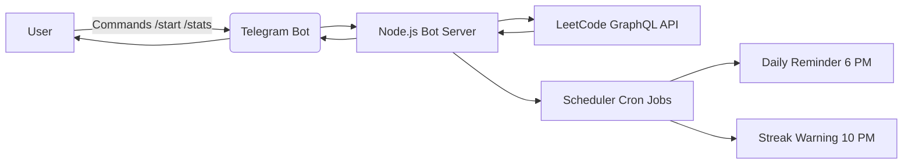
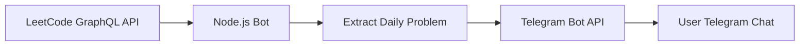

<p align="center">
  
</p>

# 🚀 LeetCode Daily Problem Telegram Bot


A **Telegram bot** that automatically sends the **LeetCode Daily Challenge** to your Telegram chat every day.  
This project fetches the daily problem from **LeetCode GraphQL API** and sends it directly to Telegram using a bot.

Perfect for developers who want to stay consistent with **DSA practice**.

---
## 🏗️ System Architecture



## 📌 Features

✅ Daily LeetCode reminder  
🔥 Streak tracking  
📊 Fetch LeetCode stats  
🤖 Telegram bot commands  
⏰ Automatic cron scheduling  
🚀 Runs 24/7 when deployed
# 📌 Features

✅ Automatically fetches **LeetCode Daily Problem**  
✅ Sends the problem **title, difficulty, and link**  
✅ Runs **automatically every day**  
✅ Built using **Node.js**  
✅ Can be deployed **24/7 on free hosting platforms**  
✅ Lightweight and beginner-friendly project  

---

# 🧠 How It Works

1. The bot fetches the **Daily LeetCode problem** using the LeetCode API.
2. The bot extracts the problem details.
3. The Telegram Bot API sends the formatted message.
4. A scheduler runs the script every day.

---

# 🏗️ Project Architecture



---

# 📂 Project Structure

```
leetcode-telegram-bot/
│
├── bot.js            # Main bot logic
├── .env              # API keys
├── package.json      # Dependencies
├── README.md         # Documentation
```

---

# ⚙️ Installation

### 1️⃣ Clone the Repository

```bash
git clone https://github.com/yourusername/leetcode-telegram-bot.git
cd leetcode-telegram-bot
```

---

### 2️⃣ Install Dependencies

```bash
npm install
```

---

### 3️⃣ Create `.env` File

Create a `.env` file in the root directory.

```
BOT_TOKEN=your_telegram_bot_token
CHAT_ID=your_telegram_chat_id
```

---

# 🤖 Create a Telegram Bot

1. Open Telegram
2. Search **BotFather**
3. Run command

```
/newbot
```

4. Copy the **Bot Token** and paste in `.env`

Example:

```
1234567890:AAHh8abcDEFghijklmnOPQRstUV
```

---

# 🆔 Get Your Telegram Chat ID

Run the bot once:

```bash
node bot.js
```

Then open Telegram and press **Start** on your bot.

Terminal will show:

```
Your Chat ID is: XXXXXXXX
```

Add that to `.env`.

---

# ▶️ Run the Bot

```bash
node bot.js
```

Example message received in Telegram:

```
🔥 LeetCode Daily Challenge

📌 Problem: Two Sum
⚡ Difficulty: Easy

🔗 https://leetcode.com/problems/two-sum/
```

---

# 🌍 Deploy for 24/7 Usage

You can deploy the bot on:

- Render
- Railway
- Cyclic
- Replit

### Recommended: Render

Steps:

1. Push code to GitHub
2. Go to Render Dashboard
3. Click **New Web Service**
4. Connect your repository
5. Add environment variables

```
BOT_TOKEN
CHAT_ID
```

6. Deploy

Your bot will run **24/7 automatically**.

---

# 📦 Dependencies

Install using:

```bash
npm install node-telegram-bot-api axios dotenv node-cron
```

Libraries used:

- node-telegram-bot-api
- axios
- dotenv
- node-cron

---

# 💡 Future Improvements

- Multiple daily problems
- Difficulty filters
- User solving streak tracking
- Topic-wise DSA problems
- Multi-user support

---

# 👩‍💻 Author

**Vrushali Parmar**

Electronics & Telecommunication Engineering Student  
Interested in **Data Analytics, Software Development, and VLSI**

---

# ⭐ Support

If you found this project useful:

⭐ Star the repo  
🍴 Fork the project  
📢 Share it

---

# 📜 License

MIT License
